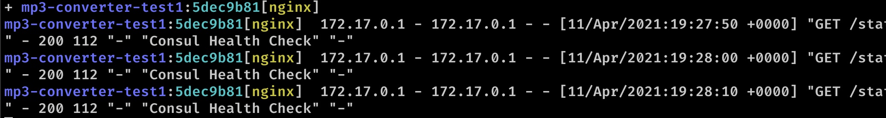

# Sternom

## Installation

```bash
go get github.com/korchasa/sternom
sternom --help
```

## Usage

```
Tail multiple jobs and allocations from Nomad

Usage:
  sternom job-or-alloc-prefix [flags]

Flags:
  -a, --address string   The address of the Nomad server. Overrides the NOMAD_ADDR environment variable if set. (default "NOMAD_ADDR")
      --color string     Color output. Can be 'always', 'never', or 'auto' (default "auto")
  -f, --follow           Whether the logs should be followed
  -h, --help             help for sternom
      --stderr           Show only stderr log
      --stdout           Show only stdout log
  -t, --tail int         The number of bytes from the end of the logs to show. Defaults to -1, showing all logs. (default -1)
  -v, --version          Print the version and exit
```

## Examples

Tail old records by job prefix:

```bash
sternom ovc
```


Skip old records and follow logs by allocation id:

```bash
sternom 2b79b1e1 --follow --tail 0
```



Watch for 404 errors from `95.217.226.19`, but skip `Build/OPM1.171019.026` user-agent:

```bash
sternom mp3 --follow | grep "nginx" | grep " 404 " | grep -v "Build/OPM1.171019.026"| grep "95.217.226.19"
```
